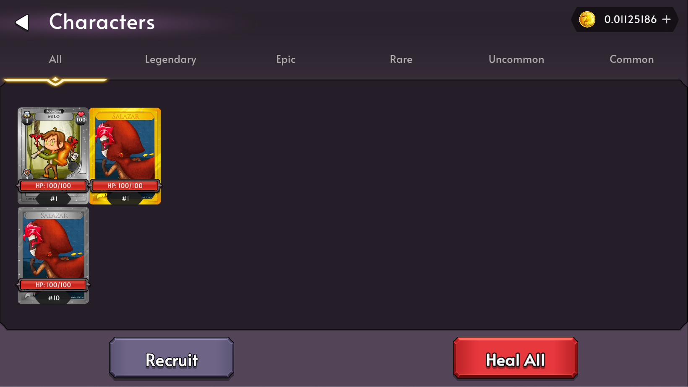
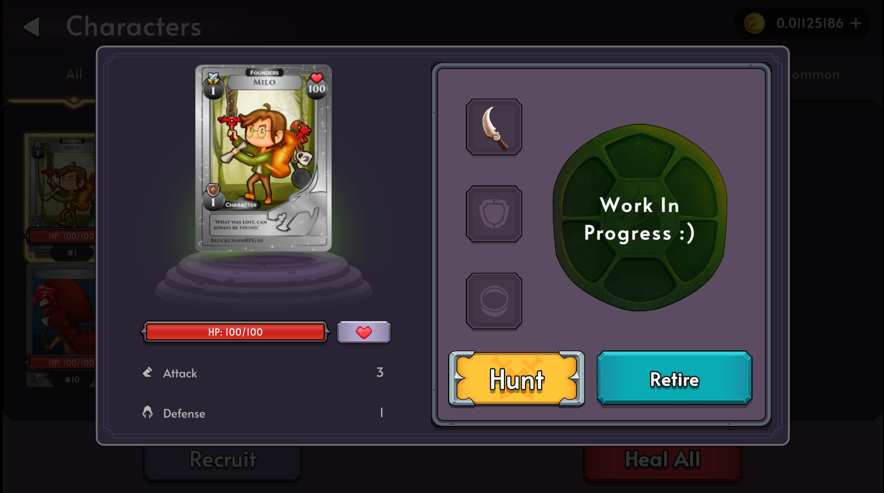
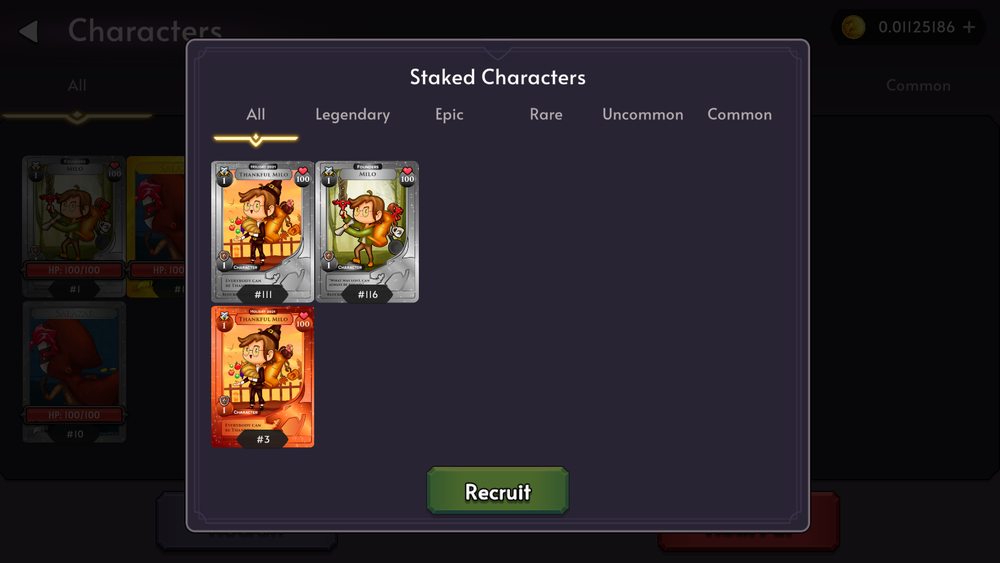
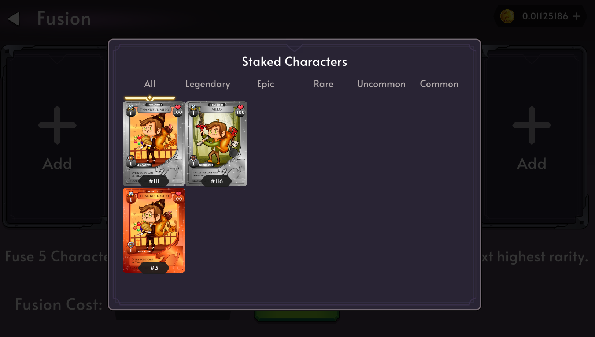

# Patch Notes

- New Limited Starter Pack drop in the market using staked GOLD (100 available)
- New Characters Screen to show more characters
- Sort Characters by Rarity
- Removed Free Heals (In favour of auto regen)
- Fixed mint number not showing for fusion and recruit

## New Limited Starter Pack Drop

We are allowing the Starter Pack to be purchased using 0.005 GOLD (500k gp) in the Market. This drop will be limited to 100 packs only.

## New Character Screen

## New Character Popup

## Recruit Popup

## Fusion Select Popup

