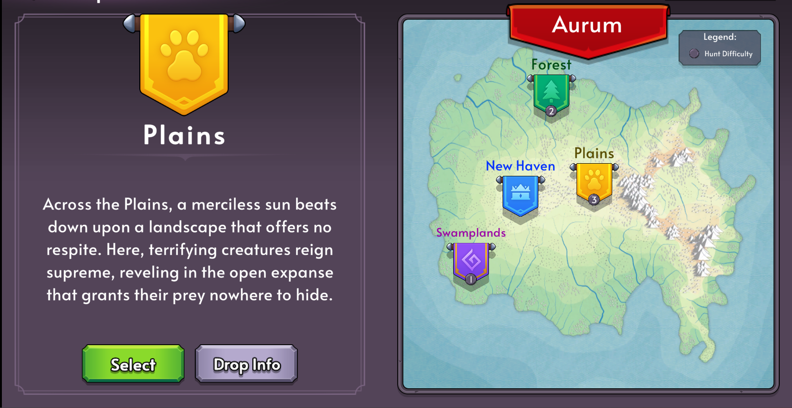
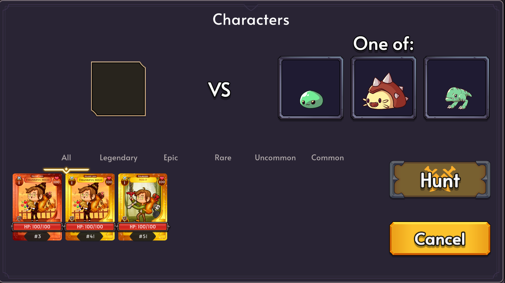

# 5.2.0 Release Notes

Hello Adventurers! We have been cooking up some great updates for you all along side a lot of revamps and improvements under the hood.

# Patch Notes

- New Hunting Ground - Plains
- Hunts will now reward Artifacts instead of Equipment.
- Added a Hunt Select Screen
- Players can now cancel an Unstaking item
- Monster images are more memory efficient.
- Added a "recruit" button for staked characters (workaround for player's who are unable to auto recruit)
- Unstakes will now be handled by the unstake contract, instead of game contract (should be more resource efficient)
- Revamped loottables to allow more customization
- Lots of package and dependency updates
- Drop icons are a bit bigger

## New Hunting Grounds

The long awaited third hunting ground is now available!
Meet the Plains where the monsters are stronger than ever.

## Hunt Select Screen

The map will now show from the dashboard and selecting a hunting ground will show the animated images of the monsters before the hunt. Players will also be able to select the characters that will go on the hunt from this screen.
