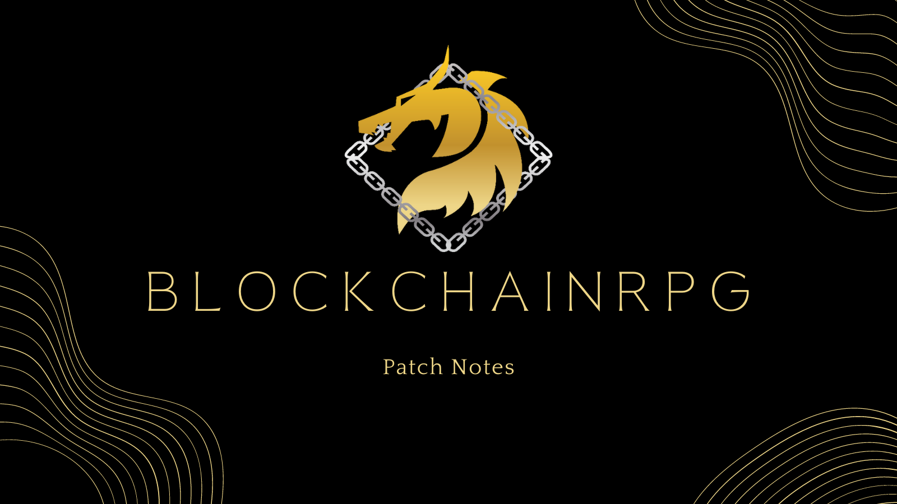

# Release Notes

### ✨ New Features

- Season Reset
  - We will be ending [Season 2](/docs/game-mechanics/level-system/season2) and resetting levels for everyone.
  - Please note there may be maintainence in the next few days as we get ready for Season 3
  - Players who placed top ten will receive a Trophy sticker based on your ranking.
    - Ranks 6-10 will recieve a Top 10 Sticker
    - Ranks 2-5 will recieve a Top 5 Sticker
    - Rank 1 will recieve a Top 1 Sticker

- Battle Pass
  - We want to also be more transparent about when seasons will end and the rewards. To facilitate this, we are introducing a Battle Pass System
  - Players are now able to see aand claim rewards from the Free Pass as they level up during a season
  - We are also offering a premium Battle Pass to allow for even more rewards.

- New Quests!
  - Added new Daily Craft quest
  - Added new Daily Boss Fights quest
  - Completed Quests will now have a completed icon

- Leaderboard will now display older season rankings as well

- Added Artifact conversions for the wood set (old equipment)
  - See here: [Artifact Conversion](/docs/game-mechanics/artifacts/conversion)

- Players are now able to open packs directly in the game from your unstaked inventory.
  - This is an experimental feature. If any issues arise, please manually claim your packs here:
    [current collection](https://neftyblocks.com/collection/brpg/packs)
    [old collection](https://neftyblocks.com/collection/blokchainrpg/packs)

- Added Send button for Chat

### 🎨 Improvements

- GOLD pool balancing
  - To improve GOLD pool stability, we have increased the GOLD pool generation rate from 0.00000003 GOLD per second to 0.00000010 GOLD per second.
  - We have also updated the pool claim logic to balance this out to have gold rewards stay relatively the same.
  - In the long term, this will allow for less drastic fluctuations within a day and keep GOLD rewards healthy.

- Better reward screen for quests, packs, battlepass etc.

- Optimize retrieving unstaked inventory data.
- Optimize Staked Inventory Data
- Optimize Event Handling
- Refactor and removed old code

### 🐛 Bug fixes

- Fixed Daily Hunt Quest (finally lol)
- Fixed gp formatting bug on Hunt result screen
- Fix Fusion display bugs
