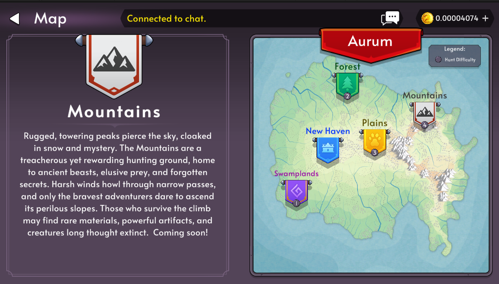

# V5.19.0 Release Notes

Get ready for some major updates as we gear up for **Season 4**! This release introduces powerful new tools and critical improvements to your gameplay experience.

---

## ✨ New Features

- 🏆 **[Leaderboard](/leaderboard)** added to the main site

  - Track your progress with detailed daily and seasonal stats:
    - Daily Hunts
    - Daily Crafts
    - Daily Boss Fights
    - Seasonal Level

- 🧹 **Clear Cache button** added in Settings
  - Useful for troubleshooting or refreshing your client if you run into issues.

---

## 🎨 Improvements

- ⚙️ Optimized loading of staked inventory
- ⏳ Improved retrieval of unstaking items
- ⚖️ Rebalanced hunt rewards for better progression
- 🪟 Boss Summon window no longer vertically scrolls – cleaner UI!

---

## 🐛 Bug Fixes

- 🎒 Fixed a visual glitch with unstaking items
- 🎫 Fixed errors when claiming battlepass rewards
- 📜 Resolved an issue affecting quest reward claims

---

# 🌟 Season 4 Announcement

Season 3 is coming to a close!  
🗓 **End Date:** June 11, 2025

- All **seasonal levels, experience, and battlepass progress** will reset.
- Be sure to **claim your Season 3 rewards** before the deadline!
- Season 4 launches immediately after – with fresh challenges and progression.

---

# 🏔️ New Hunt Area – _The Mountains_

Brave the towering peaks and storm-lashed cliffs of **The Mountains**, a brand-new hunting zone launching alongside Season 4!

- Explore treacherous terrain and face fearsome new enemies.
- Discover rare materials and powerful loot in this high-altitude battlefield.
- Only the most prepared adventurers will survive the climb!

---

Thanks for playing, and happy hunting!
