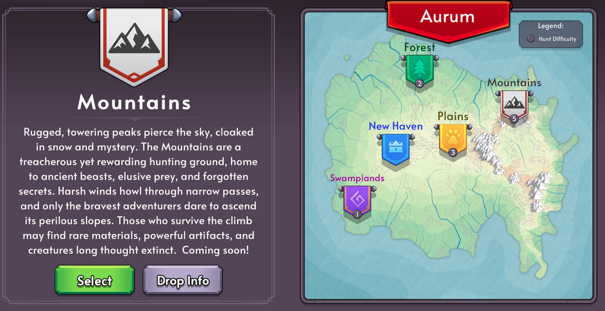

# V5.20.0 Release Notes

## ✨ New Features

# 🏔️ New Hunt Area – _The Mountains_

Brave the towering peaks and storm-lashed cliffs of **The Mountains**, a brand-new hunting zone launching alongside Season 4!

- Explore treacherous terrain and face fearsome new enemies.
- Discover rare materials and powerful loot in this high-altitude battlefield.
- Only the most prepared adventurers will survive the climb!
- Beware as the Mountains are a level 5 Hunt Difficulty

# Season 4 Release

Levels, battle pass and exp are now reset.

---

## 🎨 Improvements

- API server refactors

---

## 🐛 Bug Fixes

- Fix Artifact Image

---

Thanks for playing, and happy hunting!
