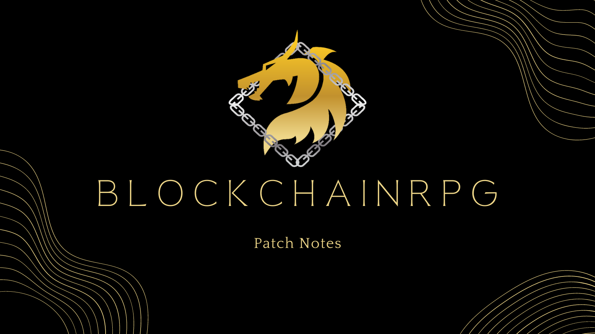

# V6.0.0 Release Notes

V6.0.0 is our biggest update yet. We're launching the **BlockchainRPG Dashboard** — a brand-new way to play right in your browser — adding **team boss fights**, and giving in-game chat a complete makeover.

---

## 🚀 The Dashboard: A New Way to Play

Meet the **[BlockchainRPG Dashboard](https://dash.blockchainrpg.io/)** — a fast, modern way to manage your characters and play, right in your web browser on desktop or mobile.

👉 **Play now at [dash.blockchainrpg.io](https://dash.blockchainrpg.io/)**

- Everything in one place: **inventory, crafting, hunting, boss fights, fusion, salvage, healing, summoning, and the marketplace**.
- **Daily quests, your sticker book, and boss-fight progress** are all built in.
- **Profile pages** let you check out any player's characters and progress.
- Sign in with your wallet using **Anchor or Wombat**.
- Prefer the Classic experience? It's not going anywhere — play whichever you like. Both share the same account, characters, and progress.

The Dashboard runs right alongside Classic. Same game, same characters — just a fresh new way to play.

---

## ⚔️ Team Up for Boss Fights

Last update brought party play to hunts. Now you can take on **bosses as a team**, too.

- **Send a party of up to 5 characters** at a boss in one go.
- Your characters face the boss **one at a time** — when one falls, the next steps up.
- The boss remembers the damage you've done. **Even if your party wipes, you've chipped away at its health** for the next group that comes along.
- **All the loot goes to you**, the party leader.
- Cooldowns match party hunts: **5 minutes** for survivors, **60 minutes** for any character that falls.
- Both the Dashboard and Classic support party play, with a refreshed results screen showing how each of your characters did. Characters clear out automatically after a fight, so you can line up your next group right away.

---

## 💬 Chat, Reimagined

In-game chat got a complete makeover — and it now works the same across both the Dashboard and Classic.

- **Direct message** any player — just tap their name in chat or hit "Message" on their profile. Your conversations stick around between visits.
- **Guild chat** keeps your guild's conversations in their own private room.
- **Send stickers** you own to liven things up.
- **Catch up instantly** — recent messages load the moment you join a room.
- **Browse without signing in** — public chat streams live even before you log in; you'll just need to sign in to post.

Chat is faster and more reliable than ever, with no separate login — it uses the account you're already signed in with.

---

## 🎨 Looks & Feel

- **Refreshed character cards** in the Dashboard — clean sword and shield icons for attack and defense, full-bleed portraits, and a layout that looks great on phones and big screens alike.
- Smoother **hunting, fusion, salvage, healing, and equipping** flows.
- A new **animation when you upgrade artifacts**.
- Overhauled **profile and character pages** in the Dashboard.
- The **Daily Boss Fights quest** now reads "Fight a boss 3 times" to match what it actually tracks.
- **Accessibility improvements** across the board — better keyboard navigation, screen reader support, and focus handling.

---

## 🐛 Fixes & Improvements

- Boss fight results now show each character's **correct health**.
- **Multi-character hunts in the Dashboard** now correctly let you send up to 5 characters — they were accidentally limited to 1.
- Squashed a rare bug where a character's health could dip below zero after a knockout blow.
- Fixed several edge cases in boss fights so rewards and boss health always land correctly.
- Lots of **stability improvements** across hunts, equipping, and boss fights.

---

## 🛠️ Behind the Scenes

We did a big cleanup under the hood to make the game faster and more reliable for everyone.

- The Dashboard, Classic, and chat now live together on **one platform**, sharing the same tools and updates — so new features reach both clients faster.
- **More reliable connections** to the blockchain, with smarter retries and quicker responses when the network is busy.
- A leaner, cleaner game contract powering hunts and boss fights.
- Routine **security and behind-the-scenes updates** to keep everything running smoothly.

---

V6.0.0 is the foundation for everything we're building next. Hop into the **[Dashboard](https://dash.blockchainrpg.io/)**, gather a party, and take down a boss together.

Thanks for playing — and welcome to V6!
