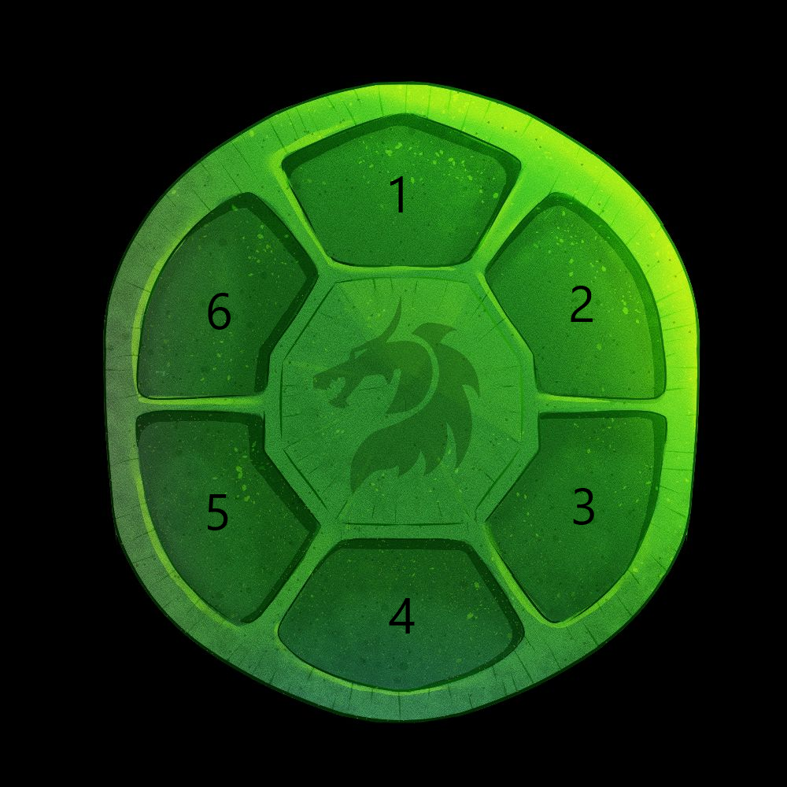

# Artifacts [WIP]

Artifacts are NFTs that characters can equip to improve their stats. The Artifact system will replace the current equipment system.

## Attributes

An Artifact will have the following Attributes:

- [Name](#name)
- [Set](#set)
- [Level](#level)
- [Primary Stat](#primary-stat)
- [Substats](#substats)
- [Slot](#slot)

### Name

The name of an artifact will be '**[Set] Artifact**'
For example, "**Constitution Artifact**"

### Set

The Set of an Artifact will give the character special set effects if there are enough Artifacts of the same set equipped.

#### Constitution

The Constitution set will give a 15% bonus to HP for every 2 Artifacts equipped.

### Level

This represents the level of the artifact. As the level increases, so do the stat bonuses.

See: [Upgrading](#upgrading)

### Primary Stat

This is the Stat a specific Artifact will primarily increase.

For Example, a Constitution Artifact with a primary stat of "ATK" will give bonus ATK. Upgrading this artifact will increase the bonus that the artifact gives.

### Substats

TDB

### Slot

This is the slot that an artifact will fit in. Each slot will have specific primary stat bonuses that it will give.

| Slot # | Possible Stat Bonus |
| ------ | ------------------- |
| 1      | ATK                 |
| 2      | N/A                 |
| 3      | DEF                 |
| 4      | N/A                 |
| 5      | HP                  |
| 6      | N/A                 |

## Upgrading

Artifacts can be upgraded using GOLD with a predetermined success rate. Each successful upgrade will increase the Level of the Artifact by 1. The maximum level of an Artifact is 15.

### Cost

| Levels | Success rate | GOLD cost |
| ------ | ------------ | --------- |
| +1→2   | 100%         | 100       |
| +2→3   | 100%         | 200       |
| +3→4   | 85%          | 300       |
| +4→5   | 70%          | 400       |
| +5→6   | 60%          | 500       |
| +6→7   | 50%          | 600       |
| +7→8   | 40%          | 700       |
| +8→9   | 30%          | 800       |
| +9→10  | 25%          | 900       |
| +10→11 | 20%          | 1000      |
| +11→12 | 15%          | 1100      |
| +12→13 | 10%          | 1200      |
| +13→14 | 8%           | 1300      |
| +14→15 | 5%           | 1400      |

### Primary Stat Changes

Artifacts come in different Rarities and cannot be upgraded to higher rarities.

The following table shows **initial stat bonus / bonus per level / max stat bonus**

| Primary Stat | Common    | Uncommon | Rare | Epic | Legendary |
| ------------ | --------- | -------- | ---- | ---- | --------- |
| ATK          | 1/1/15    | -------- | ---- | ---- | --------- |
| DEF          | 1/1/15    | -------- | ---- | ---- | --------- |
| HP           | 25/15/235 | -------- | ---- | ---- | --------- |
