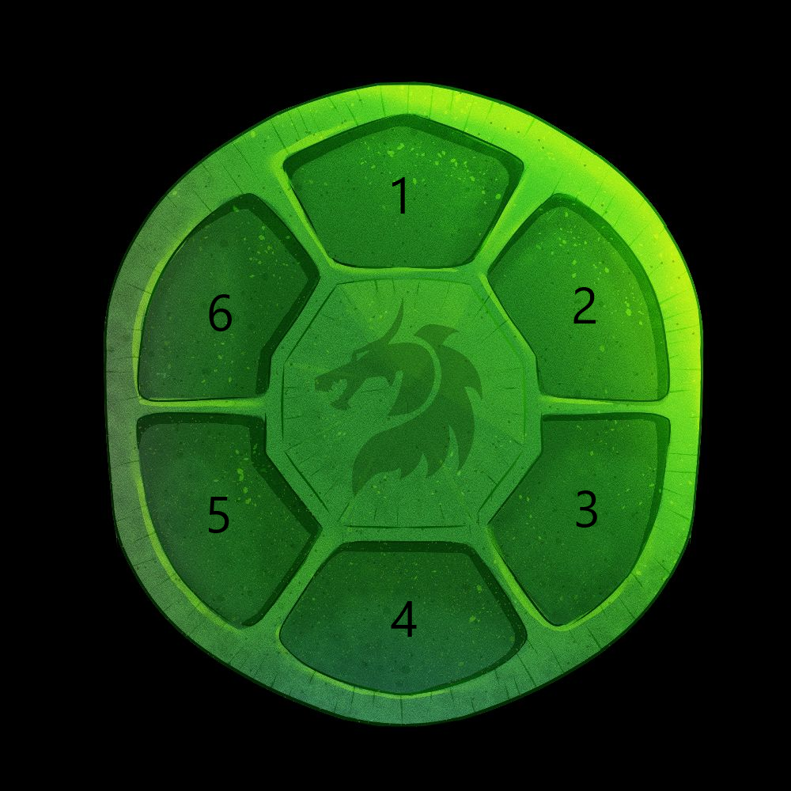

# Artifacts

Artifacts are NFTs that characters can equip to improve their stats. The Artifact system will replace the current equipment system.

At the moment, Players will be able to continue using the current equipment system OR switch to the new Artifact system. This switch will be mandatory in a future update.

## Attributes

An Artifact will have the following Attributes:

### Name

The name of an artifact will be '**(Rarity) (Set) Artifact**'

For example, "**Common Constitution Artifact**"

### Set

The Set of an Artifact will give the character special set effects if there are enough Artifacts of the same set equipped.

#### Constitution [WIP]

The Constitution set will give a 15% bonus to HP for every 2 Artifacts equipped.

### Level

This represents the level of the artifact. As the level increases, so do the stat bonuses.

See: [Upgrading](#upgrading)

### Primary Stat

This is the Stat a specific Artifact will primarily increase.

For Example, a Constitution Artifact with a primary stat of "ATK" will give bonus ATK. Upgrading this artifact will increase the bonus that the artifact gives.

### Substats [WIP]

Substats are additional bonus stats that an Artifact can give.

### Slot

This is the slot that an artifact will fit in. Each slot will have specific primary stat bonuses that it will give.

| Slot # | Possible Stat Bonus |
| ------ | ------------------- |
| 1      | ATK                 |
| 2      |                     |
| 3      | DEF                 |
| 4      |                     |
| 5      | HP                  |
| 6      |                     |

## Upgrading

Artifacts can be upgraded using GOLD with a success rate of **2/(NEXT_LEVEL)**. Each successful upgrade will increase the Level of the Artifact by 1. The maximum level of an Artifact is **5 (subject to change)**.

### Cost

| Levels     | Success rate    | Common cost (gp) | Uncommon cost (gp) | Rare cost (gp) | Epic cost (gp) | Legendary cost (gp) |
| ---------- | --------------- | ---------------- | ------------------ | -------------- | -------------- | ------------------- |
| +1→2       | 2/2 = 100%      | 2000             | 3000               | 4000           | 5000           | 6000                |
| +2→3       | 2/3 = 66.6%     | 3000             | 4000               | 5000           | 6000           | 7000                |
| +3→4       | 2/4 = 50%       | 4000             | 5000               | 6000           | 7000           | 8000                |
| +4→5       | 2/5 = 40%       | 5000             | 6000               | 7000           | 8000           | 9000                |
| ~~+5→6~~   | ~~1/6 = 16.7%~~ | ~~6000~~         | ~~7000~~           | ~~8000~~       | ~~9000~~       | ~~10000~~           |
| ~~+6→7~~   | ~~1/7 = 14.3%~~ | ~~7000~~         | ~~8000~~           | ~~9000~~       | ~~10000~~      | ~~11000~~           |
| ~~+7→8~~   | ~~1/8 = 12.5%~~ | ~~8000~~         | ~~9000~~           | ~~10000~~      | ~~11000~~      | ~~12000~~           |
| ~~+8→9~~   | ~~1/9 = 11.1%~~ | ~~9000~~         | ~~10000~~          | ~~11000~~      | ~~12000~~      | ~~13000~~           |
| ~~+9→10~~  | ~~1/10 = 10%~~  | ~~10000~~        | ~~11000~~          | ~~12000~~      | ~~13000~~      | ~~14000~~           |
| ~~+10→11~~ | ~~1/11 = 9.1%~~ | ~~11000~~        | ~~12000~~          | ~~13000~~      | ~~14000~~      | ~~15000~~           |
| ~~+11→12~~ | ~~1/12 = 8.3%~~ | ~~12000~~        | ~~13000~~          | ~~14000~~      | ~~15000~~      | ~~16000~~           |
| ~~+12→13~~ | ~~1/13 = 7.7%~~ | ~~13000~~        | ~~14000~~          | ~~15000~~      | ~~16000~~      | ~~17000~~           |
| ~~+13→14~~ | ~~1/14 = 7.1%~~ | ~~14000~~        | ~~15000~~          | ~~16000~~      | ~~17000~~      | ~~18000~~           |
| ~~+14→15~~ | ~~1/15 = 6.7%~~ | ~~15000~~        | ~~16000~~          | ~~17000~~      | ~~18000~~      | ~~19000~~           |

### Primary Stat Changes

Artifacts come in different Rarities and cannot be upgraded to higher rarities.

The following table shows **initial stat bonus / bonus per level / max stat bonus.**

_Note: These stats are subject to change_

| Primary Stat | Common    | Uncommon  | Rare      | Epic      | Legendary |
| ------------ | --------- | --------- | --------- | --------- | --------- |
| ATK          | 1/1/15    | 2/2/30    | 3/3/45    | 4/4/60    | 5/5/75    |
| DEF          | 1/1/15    | 2/2/30    | 3/3/45    | 4/4/60    | 5/5/75    |
| HP           | 10/10/150 | 20/20/300 | 30/30/450 | 40/40/600 | 50/50/750 |

