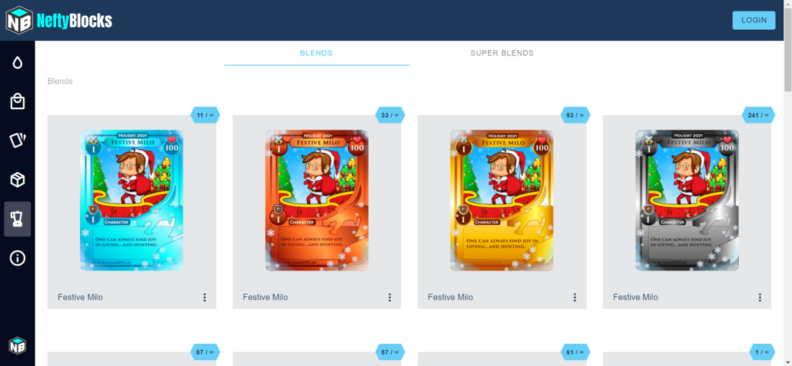
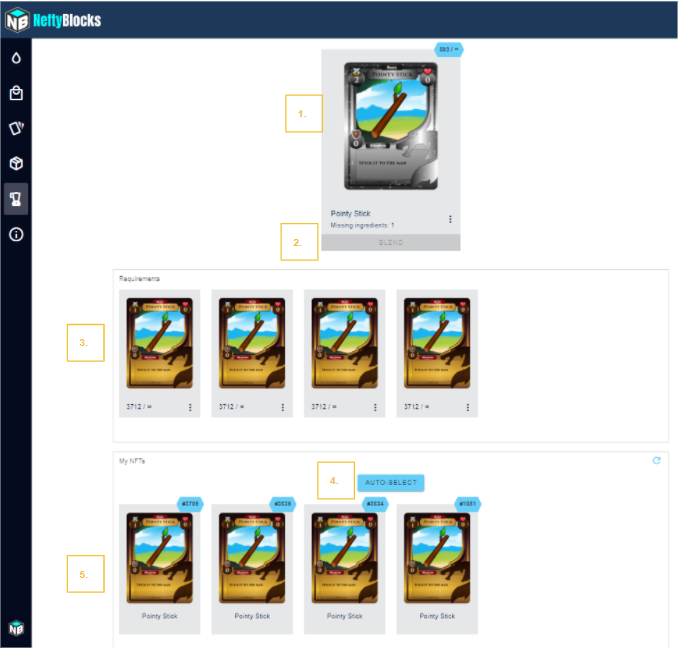
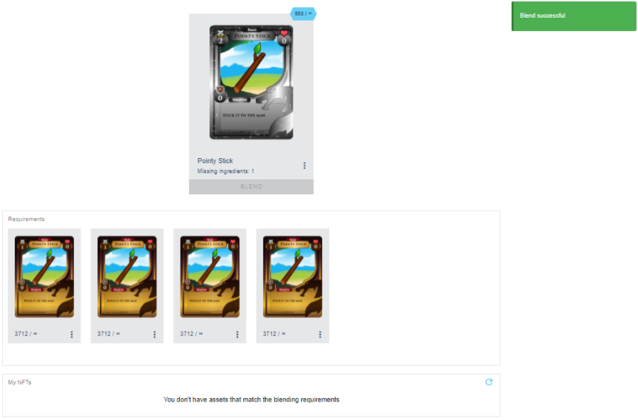

# Blending

When adventurers find duplicate rewards they have a few choices on what to do with the items. They can choose to gift it to a friend, sell it on the open market, or blend it towards a rarer and stronger item on third-party website, NeftyBlocks.

:::caution Note
Please be aware that we are moving away from blends and there will be limited support in issues.
:::

# How to Blend

Visit https://neftyblocks.com/c/blokchainrpg/blends and Login

After logging in, select the item you are looking to create and click on it, and the below page will appear:

1. Selected Item / Blend Result
2. Blend button (grayed out when blend materials have not been selected)
3. Required blend materials
4. Auto-Select button
5. Your unstaked blend materials

Click on auto-select to instantly select all the necessary blending materials or click on the materials individually to select which items will get blended if you have more than the required amount of materials

After selecting your materials, the "Blend" button will turn blue in color, indicating the requirements have been met, and you are now able to blend the materials to create your desired item

Click "Blend" and after a successful blend a green message will appear in the top-right of the screen notifying you the blend was successful

The blended item will appear in your in-game inventory after you perform a hunt or refresh the game
