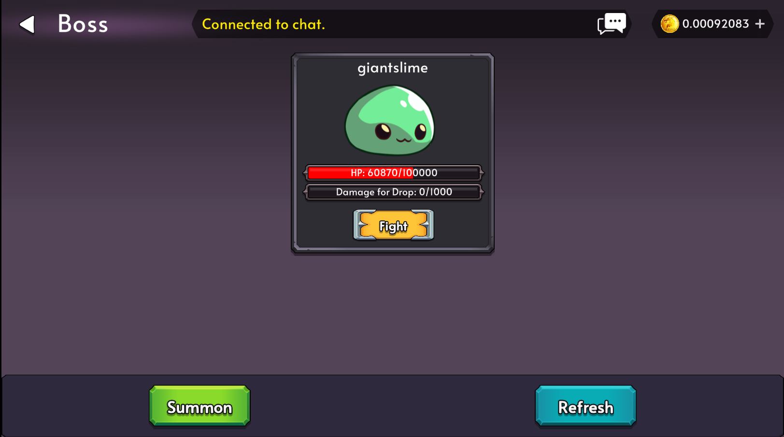

# Bosses

Bosses are unique powerful monsters that players can fight for greater rewards, but be careful as they are extremely deadly.

Bosses will have their HP shared for everyone. This means that everyone must work together in order to defeat them!

Characters that die whilst fighting a boss will only suffer a max death penalty of 5 minutes.

Each boss will have a rarity which will dictate the strength and rewards of the boss.

## Drops

Bosses will have their own Loot Table. In order to recieve a drop, a player must do enough cumulative damage to a boss. Every 1% of the max health of a boss will reward the player with a roll in the Boss's loot table.

**Additional Rolls**
- The player who performs a "Last Hit" on the boss will receive an additional Roll.
- If the boss was Summoned, then the player who summoned the boss will also receive an additional Roll on Boss death.

## Summoning A Boss

Bosses can be summoned via the Summon Button on the Bosses Screen.

## Boss List

Here are the different Bosses that you can fight

### Giant Slime

The Giant Slime is a Common boss that can be summoned.

#### Summoning Cost

- 5000 gp
- 10 CEE
- 250 SLIME

#### Stats

| Stat | Amount  |
| ---- | ------- |
| HP   | 100,000 |
| ATK  | 10      |
| DEF  | 10      |

#### Drops

| Odds | Outcome                                                                  |
| ---- | ------------------------------------------------------------------------ |
| 80%  | 10x GOLD                                                                 |
| 10%  | [Token Loot Table](/docs/game-mechanics/loottables#token-loot-table)     |
| 10%  | [Special Loot Table](/docs/game-mechanics/loottables#special-loot-table) |

### Holiday Treant

The Holiday Treant is an Uncommon boss that can be summoned for a Limited Time only!

#### Summoning Cost

- 10000 gp
- 10 UEE
- 50 IRNWOOD

#### Stats

| Stat | Amount  |
| ---- | ------- |
| HP   | 200,000 |
| ATK  | 20      |
| DEF  | 20      |

#### Drops

| Odds | Outcome                                                                  |
| ---- | ------------------------------------------------------------------------ |
| 70%  | 20x GOLD                                                                 |
| 10%  | [Token Loot Table](/docs/game-mechanics/loottables#token-loot-table)     |
| 20%  | [Special Loot Table](/docs/game-mechanics/loottables#special-loot-table) |
