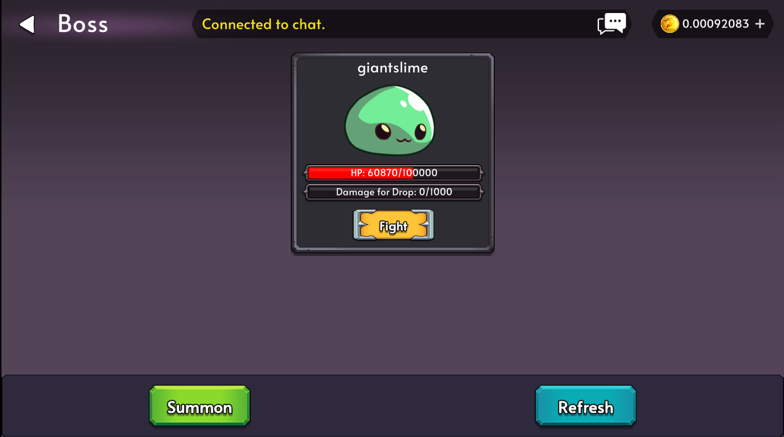

# Bosses

Bosses are unique powerful monsters that players can fight for greater rewards, but be careful as they are extremely deadly.

Bosses share the same HP across all attackers, so the whole community can chip away at a boss together — every fight contributes to bringing it down.

Each boss will have a rarity which will dictate the strength and rewards of the boss.

## Cooldowns

After a boss fight, each character that participated gets a cooldown:

- **Surviving characters**: 5-minute cooldown.
- **Characters that fall in battle**: 60-minute death cooldown.

## Fighting a Boss

You can fight a boss with a single character or with a **party of up to 5 characters** in a single transaction.

- Combat resolves as **pair-duels**: characters take on the boss one at a time in character-ID order; when one falls, the next character in the party steps up.
- The boss takes **cumulative damage** from the entire party.
- Even if your whole party is defeated, the damage you dealt persists on the boss — making it easier for the next group to finish it off.
- **All loot rolls go to the party leader** (the owner of the dispatched characters).

## Drops

Bosses have their own Loot Table. To receive a drop, a player must do enough cumulative damage to a boss. **Every 1% of the boss's max HP you damage rewards one roll** on its loot table.

**Additional Rolls**

- The player who performs the **last hit** on the boss receives an additional roll.
- If the boss was **summoned**, the summoner also receives an additional roll on boss death.

## Summoning A Boss

Bosses can be summoned via the Summon Button on the Bosses Screen. **Private bosses** cost 50% more to summon and have 50% more HP — only the summoner can attack a private boss.

