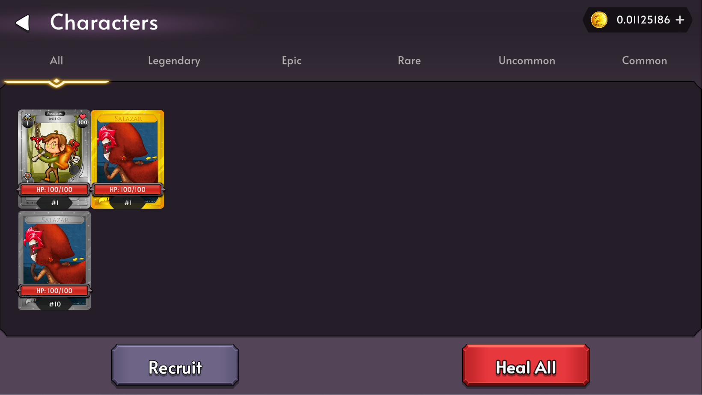
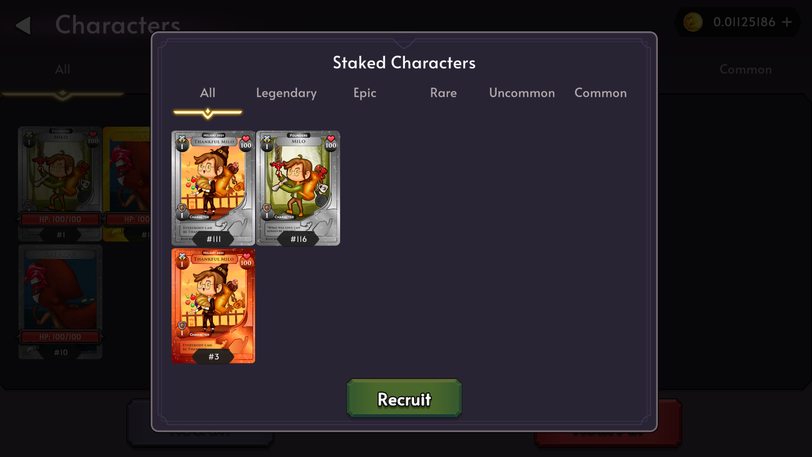

# Characters

Characters are the primary way for users to play the game. Characters must be staked in order to unlock other features such as hunting, healing, and equiping. Each Character has their own attributes which may influence how you can play the game. Characters may be purchased or opened from a Pack. They are NFTs that must be staked to be used in game.

## Character Screen

The Character Screen is the primary way to manage your characters. Clicking on a Character will display more information about the Character and allow you to [Hunt](./docs/game-mechanics/hunting), [Heal](./docs/game-mechanics/healing), or equip [Artifacts](./docs/game-mechanics/artifacts).

## Rarity

Character Rarity affects gameplay by offering a rewards multiplier for a successful hunt.

| Rarity    | Drop Rates from Packs | Hunt Reward Multiplier |
| --------- | --------------------- | ---------------------- |
| Legendary | 0.5%                  | 5x                     |
| Epic      | 2%                    | 4x                     |
| Rare      | 5%                    | 3x                     |
| Uncommon  | 15%                   | 2x                     |
| Common    | 77.5%                 | 1x                     |

## Recruiting

Note: As of v5.1.0-beta, Staking a character will automatically recruit the character. The recruit button will now be used to mass recruit staked Characters that have not been recruited.

To recruit a Character, the Character NFT must first in in your [Staked](./docs/game-mechanics/staking) inventory. You can then navigate to the Characters Screen and click recruit.

