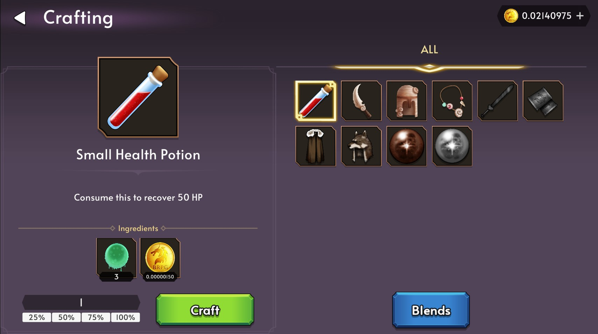
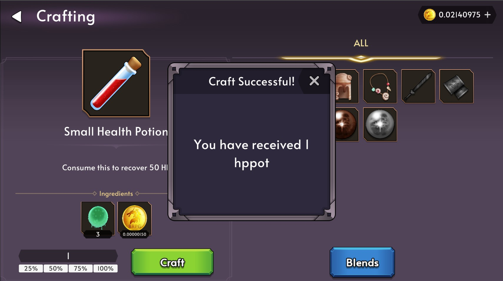

# Crafting

Adventurers can use crafting materials and GOLD rewarded during hunts to create powerful items to aid in your journey. Crafting an item will consume and burn the ingredients from your staked inventory.

## How to Craft

Enter the Crafting Screen and select the recipe you wish to craft. Enter the amount of items you wish to craft and ensure that you have the required ingredients. Once you are ready, you can Click on the Craft button and Sign the transaction.

You should then be rewarded with your crafted item.

## Recipes

We may add or change recipes at our own discretion in order to introduce new features or balance the game.
