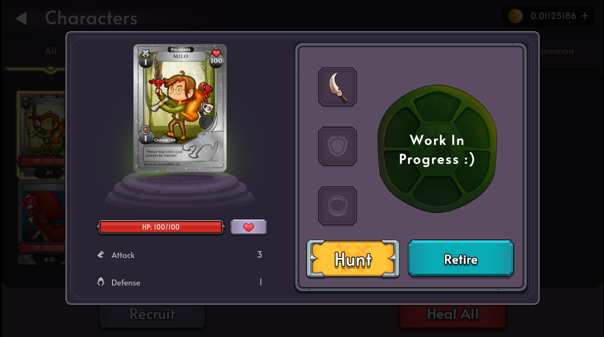
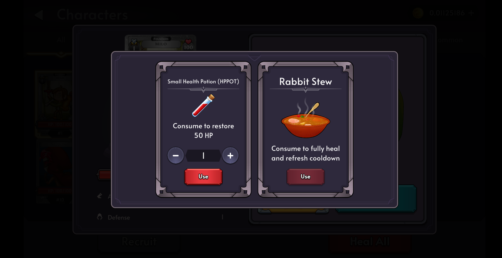

# Healing

There will eventually come a time when an adventurer will need to heal in order to avoid dying during the next hunt. You can heal either by consuming a HP Regeneration consumable item (ex. HPPOT) or using the free heal mechanic available for all adventurers.

## How to Heal

You may heal a character by going to the Characters Screen, Selecting the character you wish to heal and then clicking the red heart next to their healthbar.

There are currently three ways to heal a Character

### Auto Regen

Characters will automatically regenerate 10% of their MAXHP every hour.

### HPPOT (Small Health Potion)

Characters are able to consume HPPOTs to heal 50 health (per HPPOT) without gaining any cooldowns.

### Rabbit Stew

Characters are able to consume a Rabbit Stew to fully recover to max health and reset their cooldown.
