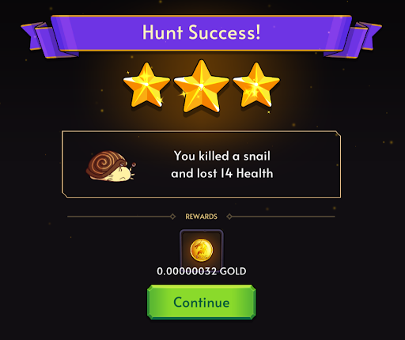
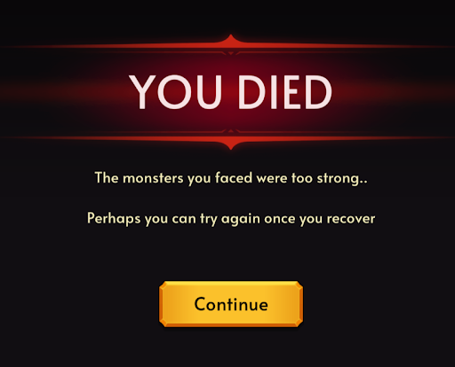

# Hunting

Hunting is the primary mechanic in the game, being the best way (outside of opening your wallet) for an adventurer to accumulate resources and loot. Each time you hunt, you will have a random chance to spawn a single monster from a group, otherwise known as a mob. Based on your stats at the time of the battle, our proprietary damage calculations will determine if you win or lose the hunt and how much HP is lost as a consequence of the hunt.

As you progress further and deeper into the unexplored Aurum wilderness, you will find that the hunts will become more challenging.
This is how adventurers will find loot in the form of GOLD, equipment, consumables, crafting materials, and more!

## Prerequisites

In order to hunt, you will need to have a Character NFT staked first. You may puchase a Character NFT Pack from our [Official BlockchainRPG Shop](https://shop.blockchainrpg.io/) or from the secondary markets.

## How to Hunt

On the Characters Screen, select the character that you wish to send on the hunt.

Clicking the "Hunt" button will show the Map to select the area in which you would like to hunt.

Click on swamplands (or another hunting ground if you desire) to travel to the hunting ground.

**Please note that the difficulty begins at 1 for the easiest hunting ground and increases to signify more difficult hunts. At more difficult hunting grounds, the mobs will deal significantly more damage to you**

You can click on the "Drop Info" button near the bottom-left of the map to see the potential rewards that can be found at a hunting ground

When you are ready to attempt your first hunt, click on the yellow "Hunt" button

## Hunt Results

### Success

If successful and your current HP exceeds the damage taken by the mob, you will receive this pop-up that states the type of mob you defeated, the HP lost, and your rewards

### Death

If the hunt fails, your character will die and receive this pop-up. Fortunately for you, death is not permanent in Aurum due to the grace of our deities. Your character will trigger a cooldown based on it's rarity and have 0 HP. It is recommended that you heal prior to hunting again.

