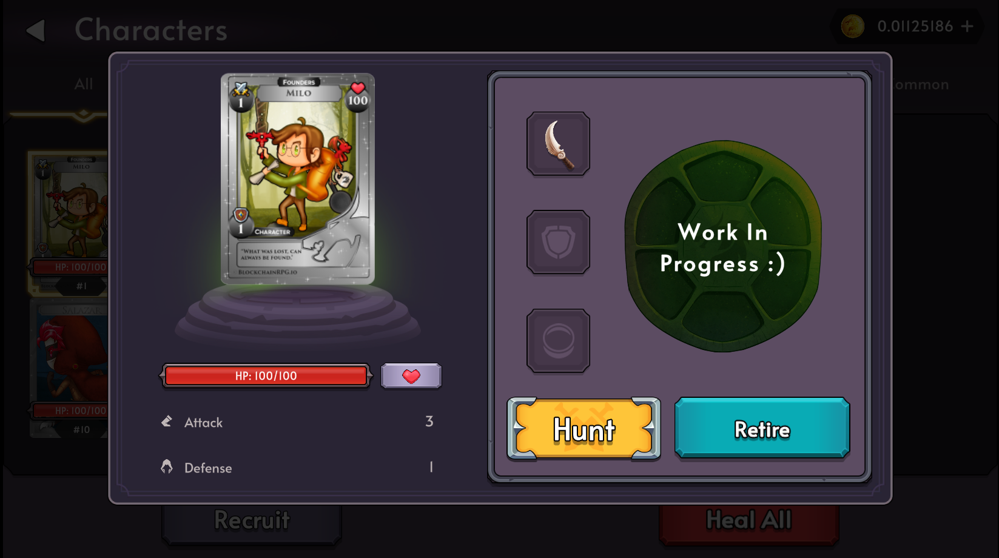
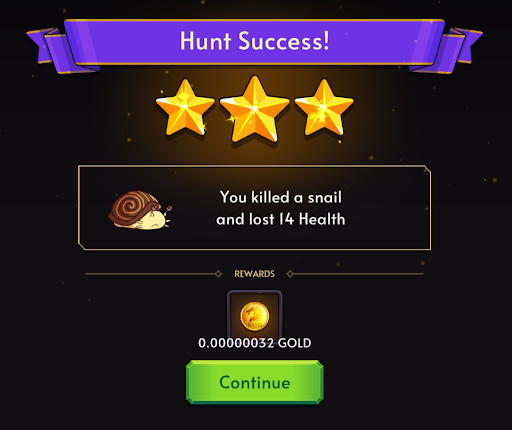
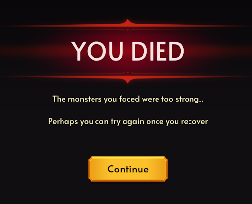

# Hunting

Hunting is the primary mechanic in the game, being the best way (outside of opening your wallet) for an adventurer to accumulate resources and loot. Each hunt sends a **party of 1 to 5 characters** into the wilderness to face a wave of mobs. Based on your party's stats and the difficulty you choose, our damage calculations determine how the battle resolves and what loot you walk away with.

As you progress further and deeper into the unexplored Aurum wilderness, you will find that the hunts will become more challenging. This is how adventurers find loot in the form of GOLD, equipment, consumables, crafting materials, and more!

## Prerequisites

To hunt, you need at least one Character NFT staked. You may purchase a Character NFT Pack from our [Official BlockchainRPG Shop](https://shop.blockchainrpg.io/) or from the secondary markets.

## How to Hunt

1. On the Characters Screen, fill your hunt party with up to 5 staked characters.
2. Click the "Hunt" button to open the Map.
3. Choose a hunting ground (swamplands and others).
4. Pick a **difficulty** from 1 (easiest) to 5 (hardest).
5. Click "Drop Info" near the bottom-left of the map to preview the loot table for that ground.
6. When ready, click the yellow "Hunt" button.

## Difficulty

Difficulty scales both the danger and the reward:

| Difficulty | Mobs | Loot Drops | Survivor Cooldown |
| ---------- | ---- | ---------- | ----------------- |
| 1          | 1    | 1          | 5 minutes         |
| 2          | 2    | 2          | 10 minutes        |
| 3          | 3    | 3          | 15 minutes        |
| 4          | 4    | 4          | 20 minutes        |
| 5          | 5    | 5          | 25 minutes        |

A higher difficulty means more mobs to face and more loot if you succeed — but mobs deal significantly more damage at higher difficulties.

## Combat Resolution

Combat is resolved as **pair-duels**:

- The first character in your party fights the first mob.
- When one of them falls, the next character (or next mob) steps up.
- The hunt continues until either your whole party is defeated or every mob is defeated.

If your party defeats all the mobs, the hunt is a success and your party leader claims the loot. Loot includes drops from the ground's loot table plus EXP.

> **Note:** If a character dies during the hunt, they will not contribute to a loot multiplier. Surviving characters' rarity multipliers still apply.

## Cooldowns

After a hunt, each character that participated gets a cooldown:

- **Surviving characters**: `5 minutes × difficulty` (so 5 min at difficulty 1, 25 min at difficulty 5).
- **Characters that fall in battle**: **60-minute** death cooldown.

You can heal characters at any time using HP potions or rabbit stew to restore HP and shorten downtime — see the [Healing](/docs/game-mechanics/healing) page.

## Hunt Results

### Success

If your party defeats all the mobs, you'll see a result screen showing each character's remaining HP, the mobs you defeated, and the rewards earned.

### Defeat

If the mobs defeat your entire party, no loot is earned and characters that fell take the 60-minute death cooldown.

