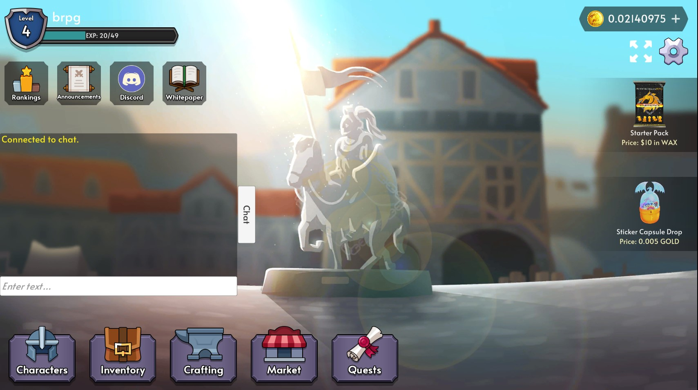

# Level System

BlockchainRPG offers a leveling system to players who wish to monitor their progress throughout the game.

Players can view their level and experience progress at the top left corner of the Dashboard Screen.

## Seasons

The Level System operates in "Seasons", after which, players will gain rewards based on their levels.

## FAQ

### Is there a level cap?

We may implement a level cap in the future, but there is no level cap at the moment

### What's the level system used for?

The team is tracking how quickly players can progress through the game.
