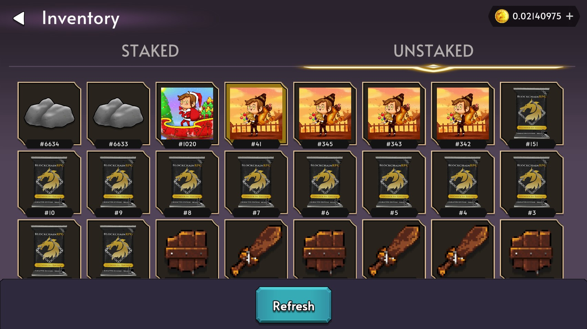
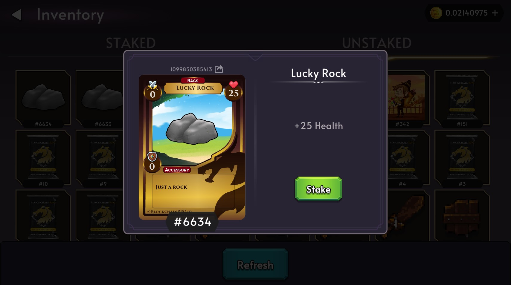

# Staking

Staking is the process of giving ownership of the items/tokens/NFTs to the game contract. This allows you to access the main features and play the game.

## How to stake in-game

To equip items, you must first "stake" them in game.
You can do so by navigating to the Inventory screen and clicking on the **UNSTAKED** tab.

Find and click the item or character you would like to stake, and click on the STAKE button.

You will be prompted to sign the transaction. Once this has been completed, you will then be able to equip the items from your **STAKED** inventory in game.

## Unstaking

You are able to unstake your items at any time but there will be a 24 hour unstaking cooldown to avoid abuse. After the 24 hour cooldown, you will be able to claim your unstaked items in game.

## FAQ

### Are there any staking rewards?

Staking is required to access gameplay in the game. Currently there is no system of rewards for staking NFTs/Tokens but this will be looked at in the future as BlockchainRPG develops further
