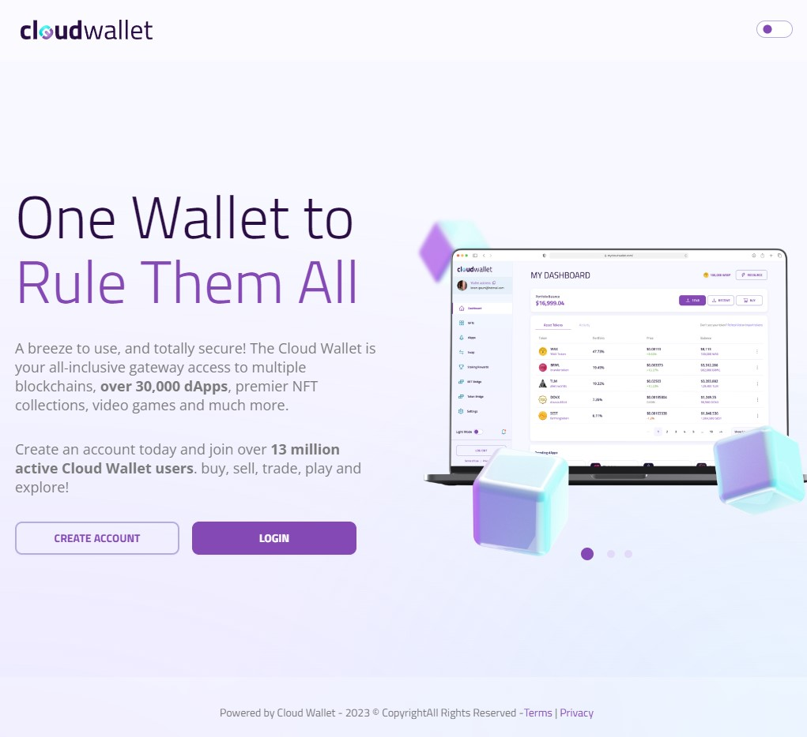

# Wallet Creation

Whether you are new to blockchain technology or a seasoned veteran, it is recommended you review the below instructions on how to get started creating your own WAX cloud wallet to begin your adventure

## Guide

### CREATE WAX Cloud Wallet (WCW)

You can sign up for the official WCW here:
https://www.mycloudwallet.com/

Click on "Create Account" and verify your email.

You may also need to purchase some WAX tokens to stake for CPU and buy RAM.

More information available here:
[What is the Blockchain, Cryptocurrency, and WAX?](./what-is-wax)
